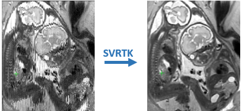

#### Welcome. This [github site](https://github.com/SVRTK) hosts software repositories for motion correction and volumetric reconstruction of fetal MRI.

## SVRTK software tools
Available from [SVRTK repository](https://github.com/SVRTK/SVRTK)

#### SVR 

Original rigid slice-to-volume registration and super-resolution reconstruction for structural fetal brain MRI

#### DSVR 
Deformable slice-to-volume registration and super-resolution reconstruction for structural MRI of shole fetal body and placenta

#### 3D+T fetal cardiac MRI

Rigid registration of slices to volumes resolved for cardiac phase and 3D+T super-resolution reconstruction

#### 3D+T fetal cardiac blood flow

Rigid registration of slices to volumes resolved for cardiac phase and 3D+T+velocity super-resolution reconstruction

#### Coming soon

Tool for reconstruction of fetal diffusion and functional MRI

## Contributors

* Dr Maria Deprez
* Dr Alena Uus
* Dr Joshua Van Amerom
* Dr Thomas Roberts

