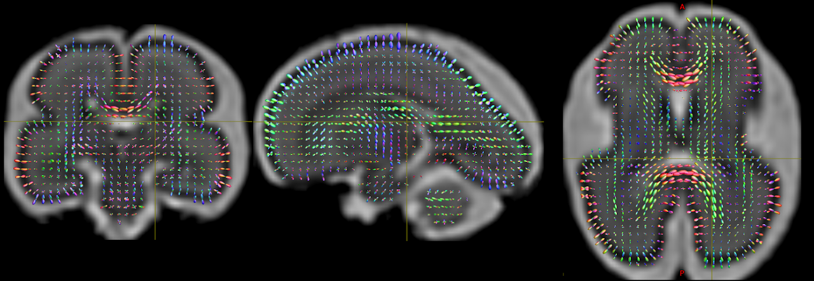

#### Welcome. This [github site](https://github.com/SVRTK) hosts software repositories for motion correction and volumetric reconstruction of fetal MRI.

## SVRTK software tools
Available from [SVRTK repository](https://github.com/SVRTK/SVRTK)

#### SVR 

Original rigid slice-to-volume registration and super-resolution reconstruction for structural fetal brain MRI

#### DSVR 
Deformable slice-to-volume registration and super-resolution reconstruction for structural MRI of whole fetal body and placenta

#### 4D fetal cardiac MRI

Rigid slice-to-volume registration resolved for cardiac phase and 4D super-resolution reconstruction

#### 4D fetal cardiac blood flow
Rigid slice-to-volume registration resolved for cardiac phase and 4D+velocity super-resolution reconstruction

#### Fetal brain diffusion MRI (HARDI)
Higher order spherical harmonics reconstruction of fetal diffusion brain MRI

#### Multi-channel reconstruction of T2* maps for fetal and placental MRI
DSVR of T2* maps with one of the echoes driving registration

#### [Automated 3D segmentation and localisation for fetal MRI](https://github.com/SVRTK/Segmentation_FetalMRI)
CNN for segmentation in motion-corrupted stacks and motion corrected volumes 

#### Coming soon
Tools for B0 distortion correction, functional MRI and multimodal reconstruction, CNN-based registration and SR

## Contributors

* [Dr Maria Deprez](https://kclpure.kcl.ac.uk/portal/maria.deprez.html)
* [Dr Alena Uus](https://kclpure.kcl.ac.uk/portal/alena.1.uus.html)
* [Dr Joshua van Amerom](https://kclpure.kcl.ac.uk/portal/en/persons/joshua-van-amerom(e4307a05-28a4-4f63-9f01-7f8aacead352).html)
* [Dr Thomas Roberts](https://kclpure.kcl.ac.uk/portal/t.roberts.html)
* [Dr Laurence Jackson](https://kclpure.kcl.ac.uk/portal/laurence.jackson.html)
* [Irina Grigorescu](https://kclpure.kcl.ac.uk/portal/en/persons/irina-grigorescu(ca5d1541-edaf-4153-aecb-4a26c3d07bf1).html)
* [Prof Jo Hajnal](https://kclpure.kcl.ac.uk/portal/jo.hajnal.html)

## Docker 
Compiled SVR toolbox is available via [DockerHub](https://hub.docker.com/repository/docker/fetalsvrtk/svrtk)

## Graphical user interface
MITK-based user interface is available from [cemrgapp repository](https://github.com/SVRTK/cemrgapp)

## Data storage repository 
The SVRTK data resources (including network weights) are available from [gin.g-node SVRTK repository](https://gin.g-node.org/SVRTK)

## MRI Physics software
Various MRI physics softwares from our colleagues are available from [mriphysics.github.io](http://mriphysics.github.io/). This includes complete pipelines for highly-accelerated dynamic [fetal cardiac cine MRI](http://mriphysics.github.io/fetalcmr.html) and [velocity](https://github.com/mriphysics/fetal_cmr_4d) reconstruction, to which SVRTK contributes.

## Thank you
We would like to thank all clinicians and physicists involved in fetal MRI acquisition and analysis for providing the datasets that allowed us to develop and optimise SVR tools:
* [Department of Perinatal Imaging & Health at King's College London / St. Thomas' Hospital](https://kclpure.kcl.ac.uk/portal/en/organisations/perinatal-imaging--health(fa53f340-67e7-4f72-9335-3992a13441ef).html)
* [Intelligent Fetal Imaging and Diagnosis (iFIND) project](http://www.ifindproject.com/)
* [Developing Human Connectome Project (dHCP) project](http://www.developingconnectome.org/project/)
* [Placenta Imaging Project (PiP) project](https://placentaimagingproject.org/project/)

We also would like to thank all developers of [IRTK](https://github.com/BioMedIA/IRTK) and [MIRTK](https://github.com/BioMedIA/MIRTK) tools, especially [Dr Andreas Schuh](https://github.com/schuhschuh). 

